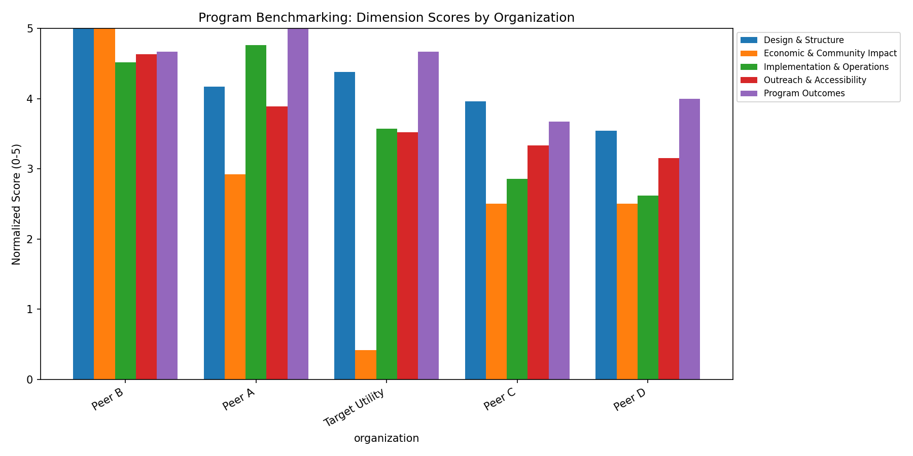

# Supplier Diversity Program Benchmarking Framework

A quantitative framework for benchmarking a supplier diversity / contract equity program against industry peers — turning scattered public disclosures into a scored, comparable, decision-ready dataset.

**Built from a real consulting engagement** benchmarking a large public utility's contract equity program against 8 peer organizations. Utility names and proprietary figures have been generalized/replaced with synthetic sample data here to respect client confidentiality — the methodology, scoring engine, and analytical approach are unchanged. See [`docs/CASE_STUDY.md`](docs/CASE_STUDY.md) for the full narrative.

## The Problem

Supplier diversity programs are usually evaluated qualitatively — "how are we doing compared to others?" — with no consistent way to answer it. Peer programs publish data in wildly different formats (PDFs, dashboards, regulatory filings, press releases), making apples-to-apples comparison hard. Leadership needed an evidence-based answer they could act on: *where does our program rank, and specifically what should we fix first?*

## Approach

1. **Built a 5-dimension, 33-indicator evaluation rubric** covering Design & Structure, Implementation & Operations, Outreach & Accessibility, Program Outcomes, and Economic & Community Impact.
2. **Scored every indicator 0–3** against a defined evidence standard (0 = not present, 3 = best-in-class), sourced only from public documentation for auditability and replicability.
3. **Normalized dimension scores to a common 0–5 scale** — `(raw score / max possible) × 5` — so dimensions with different numbers of indicators remain comparable.
4. **Benchmarked 9 organizations** individually and against a peer-average baseline, then translated the gaps into a prioritized, peer-sourced set of recommendations.

## Skills Demonstrated

| Skill | Where it shows up |
|---|---|
| Rubric / scoring framework design | 33-indicator, 5-dimension evaluation model |
| Data normalization | Common-scale comparison across uneven category sizes |
| Comparative / competitive benchmarking | 9-way peer analysis with individual + aggregate views |
| Data storytelling for executives | Gap analysis → prioritized, peer-evidenced recommendations |
| Python / pandas / matplotlib | Reusable scoring engine (see `scripts/`) |
| Research rigor | Every score traceable to a public source |

## Repository Structure

```
├── README.md                      <- you are here
├── docs/
│   └── CASE_STUDY.md               <- full write-up (situation, approach, impact)
├── data/
│   ├── sample_scores.csv           <- synthetic indicator-level scores (see note below)
│   └── summary_scores.csv          <- generated normalized output
├── scripts/
│   └── normalize_scores.py         <- scoring/normalization engine
└── visuals/
    └── dimension_comparison.png    <- generated benchmark chart
```

## Run It Yourself

```bash
pip install pandas matplotlib
cd scripts
python normalize_scores.py --input ../data/sample_scores.csv
```

This regenerates `data/summary_scores.csv` and `visuals/dimension_comparison.png` from the raw indicator scores — the same pipeline used on the real engagement, run here against sample data.



## A Note on the Data

`sample_scores.csv` is **synthetic** — generated to mirror the real dataset's structure and general pattern (strong program design, weaker economic-impact measurement) without disclosing the actual client's figures, name, or any internal deliverables. This lets the methodology and code stand on their own as a portfolio piece while keeping the underlying client engagement confidential, as it should be.

## About Me

[Your name] — transitioning into data analytics / AI transformation roles, currently completing a data analytics certificate. This project reflects how I approach ambiguous, evidence-light problems: define a measurable framework, apply it rigorously, and turn the output into recommendations someone can act on.

[LinkedIn] · [Email] · [Portfolio site, if any]
